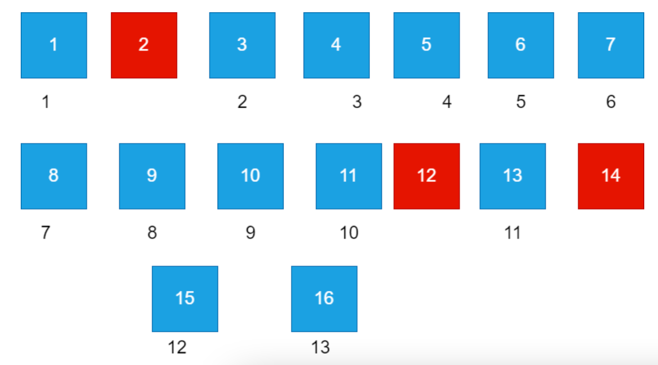
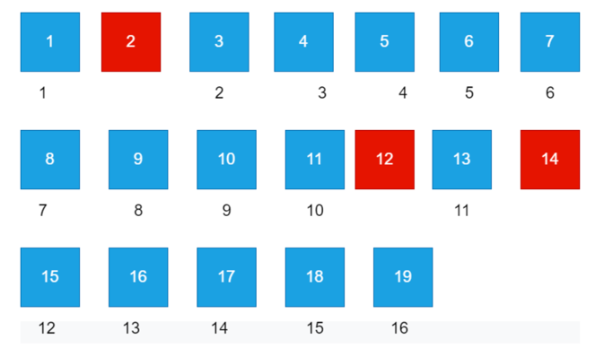

# Exam Center
Ram is excited about his college life. He has prepared well for his entrance exam and is confident of clearing it. He reaches the examination center and is allotted a number N. He tries to find the room number with the given N but is unable to do it. After some time, another aspirant tells Ram that the examination center does not have any room with number 2 or 14 in it. However, the number they have provided is the sequence room number you have to go to.


Example:

The given number N = 4


Since, room number 2 is not present, the room number that will come at the 4th position is room number 5.


Similarly, the given number N = 13.





The corresponding room number to the given number is room number 16.

> Note: The number 14 should be present as whole and not in parts.

## Example: 
134 is valid but 144 is not valid. 12, 22, 114 and all such numbers which include 2 or 14 are invalid.


This makes Ram worried as he is not able to figure out his room number and the time is running out. Can you help him find the corresponding room number for his given number so that he can reach the examination room and be relaxed for the exam?


### Input Format
The only line of input consists of a single integer, N.

#### Constraints
```
1<= N <=1300
```

### Output Format
Print the corresponding room number for the given number.

### Sample TestCase 1
#### Input
```
16
```
#### Output
```
19
```
#### Explanation

For the given, N = 16

The corresponding room number is 19.



> Time Limit(X):
0.50 sec(s) for each input.
Memory Limit:
512 MB
Source Limit:
100 KB